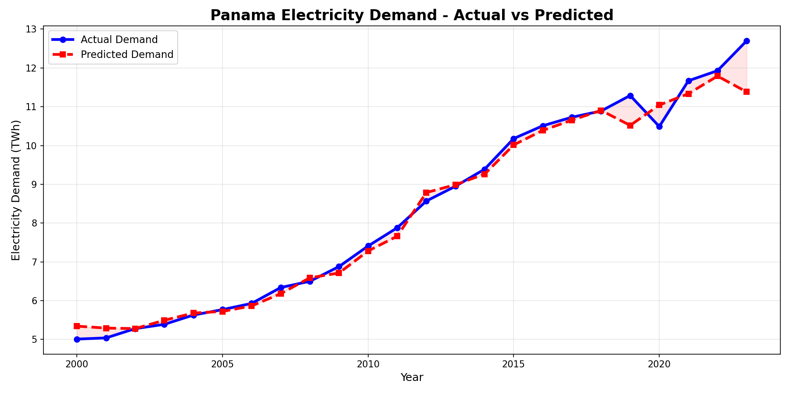
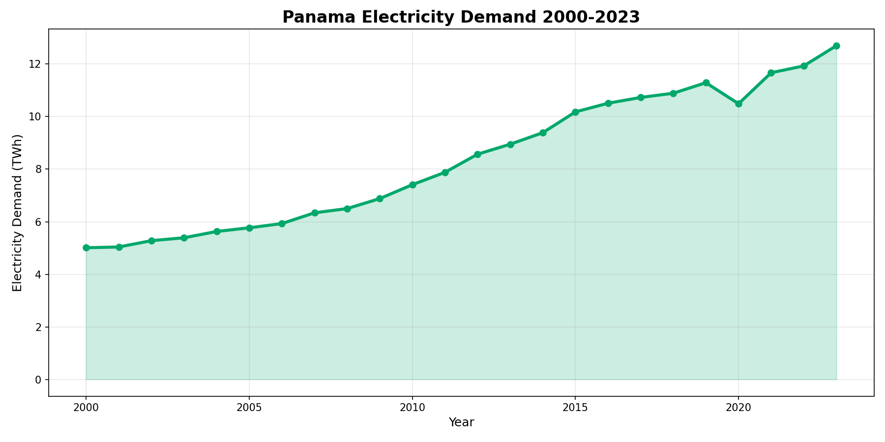
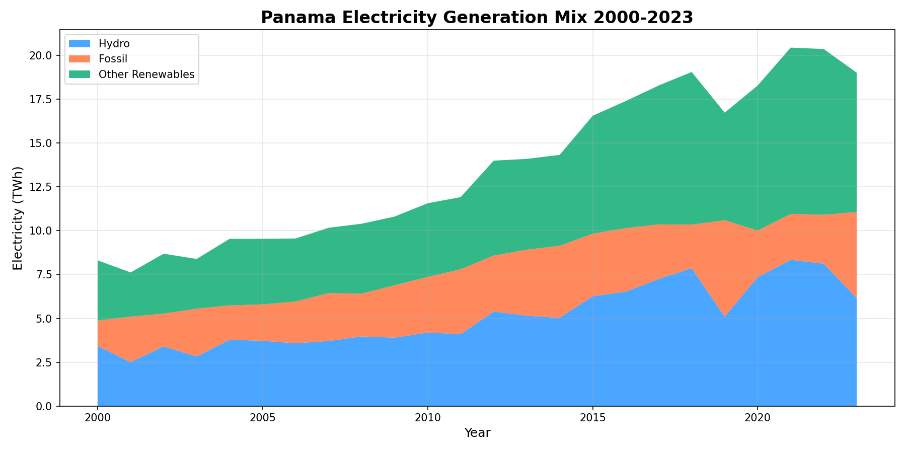
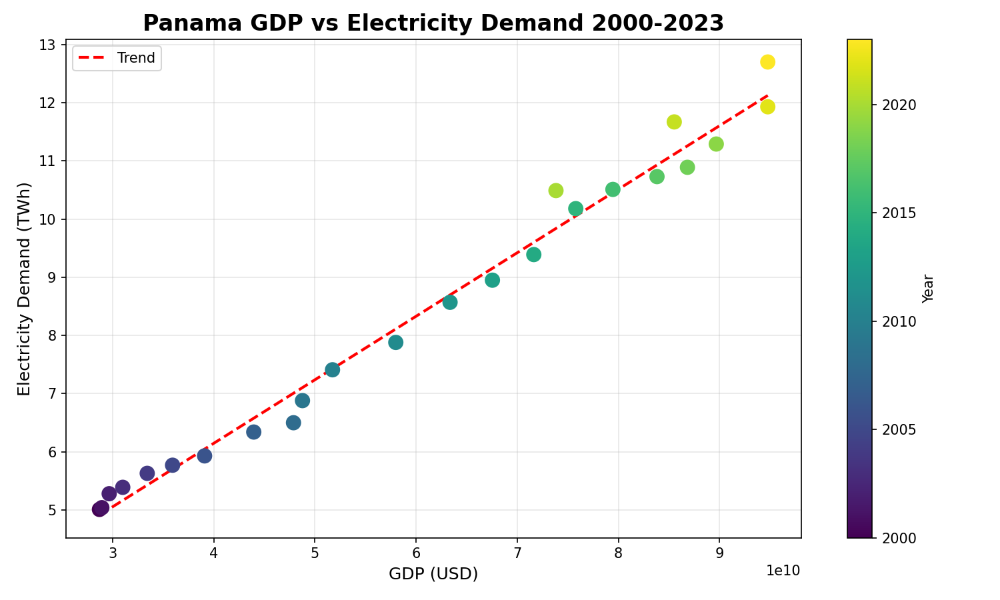

# Panama Electricity Demand Forecaster

ML model predicting Panama's national electricity demand 
using Random Forest — 97.4% accuracy

## Results
- R2 Score: 0.9784
- Accuracy: 97.43%
- Mean Absolute Error: 0.23 TWh

## Key Findings
- Panama's electricity demand nearly doubled from 2000-2023
- GDP is the strongest predictor of electricity demand
- Panama runs heavily on renewable and hydro energy

## Charts

## Tech Stack
Python, pandas, numpy, scikit-learn, matplotlib

## Data Source
Our World in Data — World Energy Consumption Dataset
